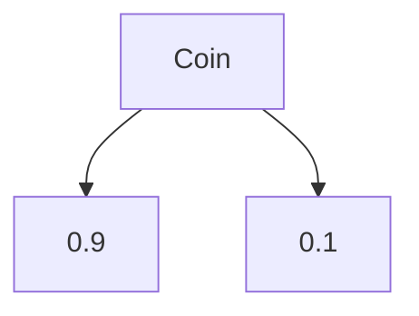
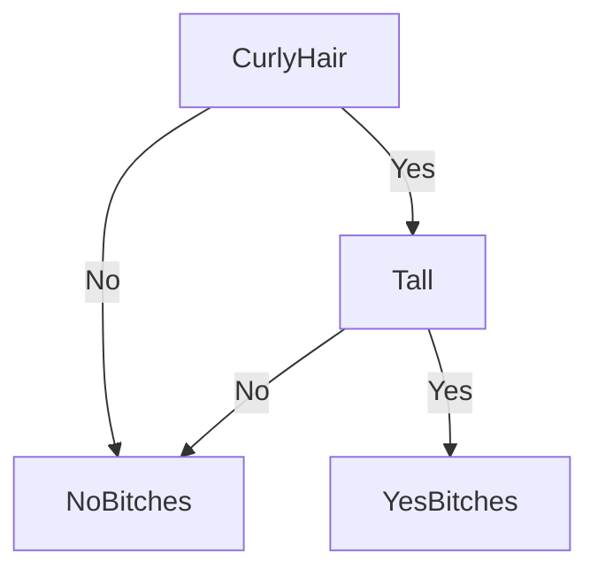

# Decision Trees

Notes on decision trees, watched materials:

 - https://www.youtube.com/watch?v=ZVR2Way4nwQ (decision tree classification clearly explained)
 - https://www.youtube.com/watch?v=T5pRlIbr6gg  (high level overview)
 - https://www.youtube.com/watch?v=YtebGVx-Fxw (entropy explained)
 - https://towardsdatascience.com/decision-trees-explained-entropy-information-gain-gini-index-ccp-pruning-4d78070db36c (example information gain)

## What Are Decision Trees
It is a tree with nodes and information that help classify information. 

You can have a table of data that represents the weather, temperature, humidity and wind of a day and then the decision is whether or not that person plays tennis. 

You will use a decision tree to classify their decision and make predictions on future datasets. 

To determine the variable used to make the splits, you have to learn about entropy and information gain and then use a greedy top down algorithm to build from the first split providing the most information to the least important split being further down.


## Entropy 

**Entropy** is just the average surprise of using a decision tree (eg you flip a coin 100 times, the entropy of that action is the average of the surprise of each of the different classes)

Surprise = $|\log_y(\frac{1}{x})|$, x being the probability that this event occurs, y being the number of options/possibilities

Thus, with $v$ being the set of all possible outcomes in a graph, $p_i$ and $s_i$ representing the respective surprise and probability of that item, 

Let $v = \{heads, tails\}$, $y = $ size of $v$

$$Entropy = 
\sum_{i\in v} s_i p_i$$
$$= \sum_{i\in v} log_y(\frac{1}{p_i}) p_i$$
$$= -\sum_{i \in v} p_ilog_y(p_i)$$

EG. you flip a coin that has a 90% chance of landing on heads


Surprise of heads:
$|\log_2(\frac{1}{0.9})| = |log_2(1) - log_2(0.9)|$
$= 0.15$
Surprise of tails: 
$|\log_2(\frac{1}{0.1})| = |log_2(1) - log_2(0.1)|$
$= 3.32$

Thus, you would be much more surprised if you landed a tails versus a heads in this case. 

Suppose you flip the coin 100 times ($v$ = {heads, tails}):

$$\sum_{i=0}^{v} s_i p_i = \frac{(100)(0.15)(0.9) - (100)(3.32)(0.1)}{100}$$
$$=0.47$$

Meaning the average surprise per coin toss is 0.47.

## Why Does Entropy Matter?

In machine learning if the entropy is higher, we are very surprised when you get an outcome, this means that you do not obtain much information from an action. 

## Information Gain

Change in entropy represents the **change in entropy** which we use to determine how much information a feature provides for a target variable. 

$$InformationGain = Entropy_{parent} - Entropy_{child}$$

Where the entropy of the child is calculated as the average entropy among the children. 

## Example Case

Let this be our dataset for our example decision tree. We want to determine the optimal splits to determine whether a student will pass or fail. 

  

Example of Information Gain calculation to determine the root node based on characteristic


Now we have to repeat this process with each other the other characteristics such as background abd other online courses and then pick the one with the highest information gain as our root node of our decision tree classifier. 

This is very time consuming to compute by hand, this is why we have libraries such as ```scikit-learn``` to build decision trees and train them. 

## Using Our Decision Tree

Let this graph be a sample decision tree:
 


Now suppose a new guy comes along: He has curly hair and is short and we want to predict if he gets bitches

Our first node says if he doesn't have curly hair, he will not get bitches. He does so we move to the right of our tree. On the right subtree, we know he is short so he moves to the left where unfortunately, our poor fellow is predicted to get no bitches. 

Note that this fellow might actually get hella bitches, sometimes the decision tree cannot be 100% accurate because the outcome ```NoBitches``` and ```YesBitches``` are the **majority** vote. This means that not having curly hair might yield ```3 YesBitches``` and ```1 NoBitches```. The majority vote is that not having curly hair means ```NoBitches```. 